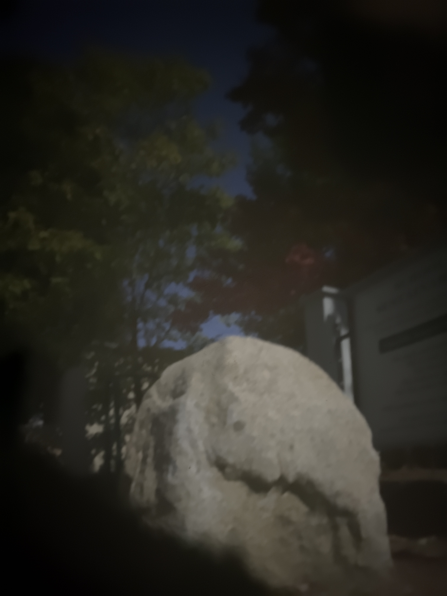

# Thanh's SuperCam 9000 - A Pinhole Camera

By Thanh Nguyen Jr

COSC 73 - Computational Photography

Professor Wojciech Jarosz

Fall 2020

## Making the Pinhole Camera Box

I started with the shipping box for my girlfriends' running shoes. I opened the box up with some scissors and lined one inside wall with white printer paper. The other walls I lined with black fabric I cut from some old frisbee shorts. The black fabric was meant to reduce any reflections from the inside walls of the box.

I also cut a hole into the fabric on the opposite wall as the printer paper. This hole is where the pinhole and camera hole will be located.

Then I closed the box up again with some packaging tape. I used ducktape to cover up the endges that may let in light. I also cut a hole into the cardboard for the camera on my phone (iPhone 11).

I then cut an almost 1 inch square above the camera hole. This is where I put my various pinholes.

Finally, I covered the 1 inch square hole with aluminum foil and made my pinholes in the foil. The aluminum foil made it really easy to size and redo the holes as I could just rip off the old foil and replace it with new foil if I ever needed to redo my pinholes.

I later punched 2 more holes into the aluminum foil and used small strips of ductape to cover 2 out of the 3 holes at a time while I was taking pictures.

Here is how the final product looked with my phone attached to it. You can see the image of the kitchen light in the camera screen!

Here is a video of the final product!

## The Photos

To test the 3 different pinhole sizes, I took photographs of the view from my house window and an apartment building wall. I used a 4 second exposure which was a good balance between getting enough light and not getting too much motion blur as my box would quiver in the wind.

I actually had to go out 2 separate days for photos as I learned that in order to get good photos, I needed to have really well lit subjects. The first time I went, it was overcast so the photos did not come out so well.

Below are my photos testing the 3 different pinhole sizes. Note that I didn't have a ruler so I couldn't measure the pinhole sizes accurately, but I did use a 0.5mm mechanical pencil to create the holes so I estimated the measurements of the pinhole based on the pencil lead size.

### Small Pinhole (~1mm), Parking Lot Shot Through a Window

### Medium Pinhole (~1.5mm), Parking Lot Shot Through a Window

### Large Pinhole (~2.5mm), Parking Lot Shot Through a Window

### Small Pinhole (~1mm), House Wall

### Medium Pinhole (~1.5mm), House Wall

### Large Pinhole (~2.5mm), House Wall

After testing the different hole sizes. I decided that I liked how the photos taken with the medium sized pinhole (~1.5mm) came out the most. The smallest hole sometimes got some very sharp photos, but it was really hard to get a bright photo. I don't actually know why in the photo from the window the smallest hole was able to get such a bright image, but I wasn't able to recreate this with other subjects.

Below are some more photos I took with this pinhole size.

### Medium Pinhole (~1.5mm), Rock

### Medium Pinhole (~1.5mm), House

### Medium Pinhole (~1.5mm), House Across the Street

### Medium Pinhole (~1.5mm), Street

### Medium Pinhole (~1.5mm), Selfie

## Random Extra Photos

Here are some other photos I took with the pinhole camera box. The pinhole sizes on these photos were not recorded.

### The Light Over My Kitchen Table

### Thanh Holding Up His Index Finger

### Blurry Trees By the Connecticut River

